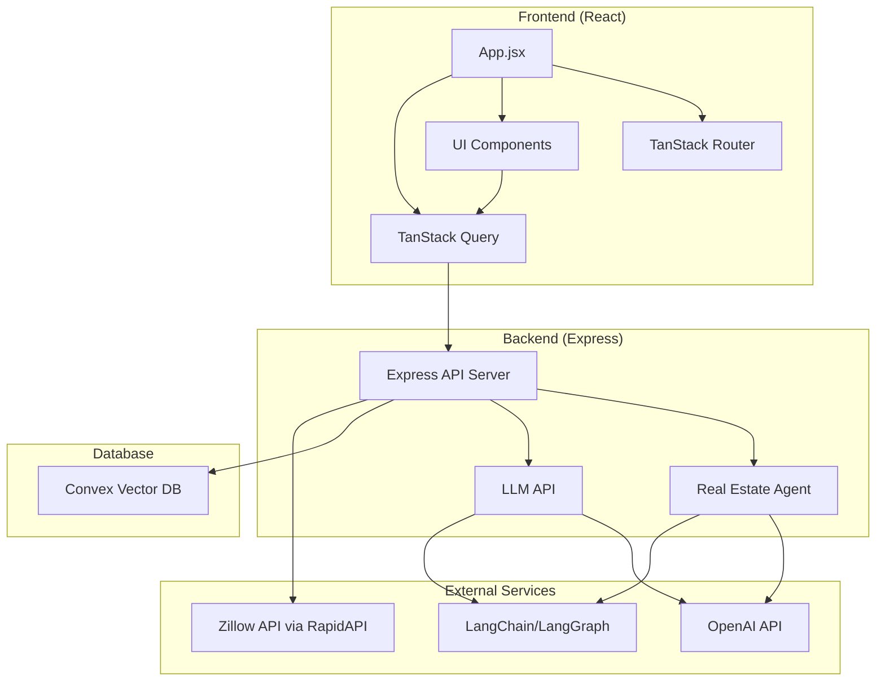

# Real Estate Application Architecture

## Key Components

- **Frontend**: React 19 with TanStack Router and Query for data fetching
- **Backend**: Express server handling API requests
- **Database**: Convex for vector storage and similarity search
- **AI Components**: 
  - LangChain/LangGraph for agent workflows
  - OpenAI for embeddings and natural language processing
- **External APIs**: Zillow API for property data